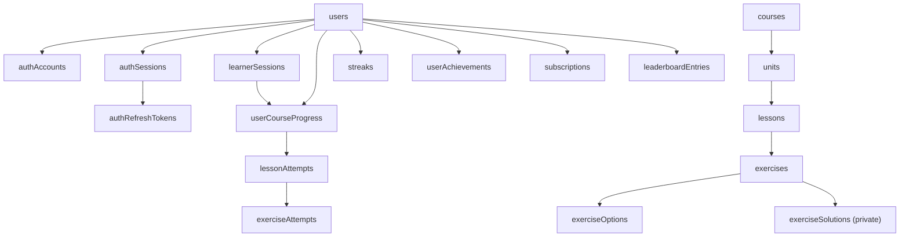

# Learn Expo Database Tables

This document explains every table in the current Convex schema. The source of truth is [`convex/schema.ts`](../convex/schema.ts). Convex Auth contributes six system tables through `authTables`; Learn Expo extends its `users` table and adds the application tables described below.

## Data boundaries

The database is intentionally divided into four areas:

1. **Authentication and identity** — accounts, sessions, credentials, and user profiles.
2. **Public learning content** — courses, units, lessons, exercises, options, and private solutions.
3. **Learner progress** — guest sessions, attempts, XP, hearts, completions, and streaks.
4. **Growth features** — achievements, subscriptions, and leaderboards.

## Shared conventions

- Convex automatically adds `_id` and `_creationTime` to every document.
- Application timestamps such as `createdAt`, `updatedAt`, and `completedAt` are Unix time in milliseconds.
- Calendar fields such as `dateKey` and `lastPracticeDate` are date-only strings, normally `YYYY-MM-DD`.
- Stable string `key` fields identify seeded content independently of deployment-specific Convex IDs.
- `status` and `order` fields make publication and display ordering deterministic.
- `publicDataJson` is safe to send to learners. `solutionDataJson` must remain server-only.
- Progress ownership is explicit: a record belongs to either a `userId` or a `learnerSessionId` according to `ownerType`.
- Server mutations derive authenticated `userId` values from Convex Auth. Clients do not choose another user's ID.

## Table summary

| Area | Table | Purpose |
|---|---|---|
| Identity | `users` | Application profile and Convex Auth user identity |
| Auth | `authAccounts` | Authentication-provider account linked to a user |
| Auth | `authSessions` | Active authenticated sessions |
| Auth | `authRefreshTokens` | Refresh-token rotation chain |
| Auth | `authVerificationCodes` | OTP, reset, magic-link, and OAuth verification codes |
| Auth | `authVerifiers` | OAuth PKCE/session verifiers |
| Auth | `authRateLimits` | Authentication attempt throttling |
| Existing demo | `tasks` | Preserved task-demo records |
| Content | `courses` | Top-level published learning paths |
| Content | `units` | Ordered sections within courses |
| Content | `lessons` | Ordered lessons within units |
| Content | `exercises` | Public exercise definitions |
| Content | `exerciseOptions` | Normalized selectable/buildable exercise items |
| Content | `exerciseSolutions` | Private answer keys and grading data |
| Learning | `learnerSessions` | Anonymous learner identity and merge state |
| Learning | `userCourseProgress` | Course-level XP, hearts, position, and completions |
| Learning | `lessonAttempts` | One resumable lesson run |
| Learning | `exerciseAttempts` | One server-graded answer submission |
| Learning | `dailyActivity` | Per-day completion and XP totals |
| Learning | `streaks` | Authenticated streak summary |
| Rewards | `learnerRewards` | Guest or authenticated gem wallet |
| Rewards | `monthlyQuestProgress` | Monthly quest counters by learner |
| Rewards | `lessonRewards` | One idempotent chest reward per lesson attempt |
| Growth | `achievements` | Achievement definitions |
| Growth | `userAchievements` | User achievement progress and unlocks |
| Growth | `subscriptions` | Premium subscription state |
| Growth | `leaderboards` | Ranking period definitions |
| Growth | `leaderboardEntries` | User XP and rank in a leaderboard |

## Authentication and identity tables

### `users`

The central authenticated identity and application profile. Learn Expo extends the standard Convex Auth user fields instead of creating a duplicate profile table.

Important fields:

- `name`, `image`, `email`, `phone` — standard identity/profile values.
- `emailVerificationTime`, `phoneVerificationTime` — verification timestamps maintained by authentication flows.
- `isAnonymous` — Convex Auth's anonymous-user marker; this is separate from Learn Expo guest learner sessions.
- `age`, `firstName`, `lastName` — onboarding profile details.
- `username`, `normalizedUsername` — display username and canonical lowercase lookup value.
- `plan` — `free` or `premium`.
- `createdAt`, `lastActiveAt` — application-level lifecycle timestamps.
- `onboarding` — validated onboarding answers and preferences.

Indexes:

- `email` supports email identity lookup.
- `phone` supports phone identity lookup.
- `normalizedUsername` supports username uniqueness and lookup.

Deletion behavior: account deletion removes the user and all user-owned progress, attempts, activity, streaks, achievements, subscription records, leaderboard entries, linked learner sessions, and authentication records. Public course content is preserved.

### `authAccounts`

Maps a `users` document to an authentication provider. One user may eventually have multiple linked providers.

Fields:

- `userId` — linked application user.
- `provider` — provider identifier such as the current password provider; Google and Apple are schema-ready.
- `providerAccountId` — provider-specific account identity.
- `secret` — optional provider credential material managed by Convex Auth.
- `emailVerified`, `phoneVerified` — verified identifiers supplied by the provider.

Indexes:

- `userIdAndProvider` finds a user's provider account and is used to derive `authProvider`.
- `providerAndAccountId` resolves a provider identity during sign-in.

This table is security-sensitive and must never be exposed through public queries.

### `authSessions`

Represents an active authenticated login. A user can have several sessions across browsers or devices.

Fields:

- `userId` — session owner.
- `expirationTime` — session expiry timestamp.

Index: `userId` supports session lookup and account-deletion cleanup.

### `authRefreshTokens`

Stores the refresh-token rotation chain for an authenticated session. Convex Auth uses the parent relationship to enforce one-time use, a short reuse window, and descendant invalidation.

Fields:

- `sessionId` — owning authentication session.
- `expirationTime` — token expiry.
- `firstUsedTime` — when the token was first exchanged.
- `parentRefreshTokenId` — token from which this token was rotated.

Indexes:

- `sessionId` lists tokens belonging to a session.
- `sessionIdAndParentRefreshTokenId` resolves token rotation relationships.

### `authVerificationCodes`

Stores temporary codes used by password reset, OTP, magic-link, and OAuth flows.

Fields:

- `accountId` — authentication account being verified.
- `provider` — provider responsible for the flow.
- `code` — temporary verification value.
- `expirationTime` — code expiry.
- `verifier` — optional verifier value.
- `emailVerified`, `phoneVerified` — identifiers verified by the successful flow.

Indexes: `accountId` and `code`.

### `authVerifiers`

Stores short-lived verifier information used by OAuth/PKCE and session validation.

Fields:

- `sessionId` — optional related session.
- `signature` — optional verifier signature.

Index: `signature` supports verifier resolution.

### `authRateLimits`

Tracks authentication throttling so repeated password or OTP attempts can be limited.

Fields:

- `identifier` — account or flow identifier being limited.
- `lastAttemptTime` — most recent attempt.
- `attemptsLeft` — attempts remaining in the current window.

Index: `identifier`.

## Preserved existing table

### `tasks`

The original Convex task-demo table. It remains intact as required by the additive migration.

Fields:

- `text` — task description.
- `isCompleted` — completion flag.

It is independent of learning content and progress.

## Public learning-content tables

### `courses`

Top-level learning offerings shown on the home screen.

Fields:

- `key` — stable content key, for example `beginner-course-1`.
- `title`, `description` — learner-facing copy.
- `kind` — currently `technology`.
- `contentLanguage` — language used by the course content.
- `subject` — topic such as Expo or React Native.
- `iconUrl` — optional course icon.
- `order` — deterministic course ordering.
- `status` — draft, published, or archived content state.
- `contentVersion` — version for additive/repeatable seed updates.
- `publishedAt`, `createdAt`, `updatedAt` — publication and lifecycle timestamps.

Indexes:

- `by_key` resolves stable course links.
- `by_status_order` efficiently returns published courses in display order.

### `units`

Ordered sections inside a course. The current seed creates one “Core lessons” unit per course, while the schema supports adding more.

Fields:

- `key` — stable unit key.
- `courseId` — parent course.
- `title`, `description` — learner-facing details.
- `order` — position within the course.
- `status` — publication state.
- `createdAt`, `updatedAt` — lifecycle timestamps.

Indexes: `by_key` and `by_course_order`.

### `lessons`

Ordered lessons inside a unit.

Fields:

- `key` — stable lesson route key.
- `unitId` — parent unit.
- `title`, `description` — learner-facing details.
- `order` — lesson position.
- `xpReward` — advertised lesson reward.
- `minimumPassingScore` — completion threshold.
- `status` — publication state.
- `createdAt`, `updatedAt` — lifecycle timestamps.

Indexes:

- `by_key` resolves generic lesson routes.
- `by_unit_order` returns the complete ordered unit path.
- `by_unit_status_order` returns only lessons in a requested publication state.

### `exercises`

Public exercise metadata and question payloads. It supports all 14 Learn Expo exercise types.

Fields:

- `key` — stable exercise identifier.
- `lessonId` — parent lesson.
- `type` — validated exercise discriminator.
- `title`, `prompt`, `instruction` — learner-facing content.
- `publicDataJson` — serialized question configuration with answer keys removed.
- `explanationJson` — optional feedback/explanation content.
- `xp` — XP available for the exercise.
- `order` — position in the lesson.
- `version` — exercise content version.
- `status` — publication state.
- `createdAt`, `updatedAt` — lifecycle timestamps.

Indexes: `by_key`, `by_lesson_order`, and `by_lesson_status_order`.

### `exerciseOptions`

Normalizes option-like data from different exercise formats so choices, matching items, and builder blocks can be queried and ordered consistently.

Fields:

- `exerciseId` — parent exercise.
- `group` — option collection, such as choices, left items, or available blocks.
- `key` — stable option identity within the group.
- `content` — display value.
- `metadataJson` — optional serialized format-specific metadata.
- `order` — position in the group.

Index: `by_exercise_group_order`.

### `exerciseSolutions`

Private grading data separated from published exercise payloads. Public content queries must never return this table's contents.

Fields:

- `exerciseId` — exercise being graded.
- `solutionDataJson` — complete serialized answer key and grading configuration.
- `createdAt`, `updatedAt` — lifecycle timestamps.

Index: `by_exercise` provides the authoritative solution during server grading.

## Anonymous and authenticated learning tables

### `learnerSessions`

Provides every guest with a server-backed learner identity before an account is required.

Fields:

- `learnerId` — opaque public learner identifier.
- `credentialHash` — server-stored hash of the high-entropy guest credential. The raw credential is never stored here.
- `userId` — authenticated user after a successful merge.
- `anonymous` — whether the session is still guest-owned.
- `createdAt`, `lastSeenAt` — session lifecycle timestamps.
- `mergedAt` — successful merge timestamp.

Indexes:

- `by_learner_id` verifies guest requests.
- `by_user` finds sessions claimed by an authenticated account.

The raw guest credential is retained securely by the client. The backend checks its hash before accepting guest progress operations or a merge.

### `userCourseProgress`

The current course-level summary for either a guest or authenticated user.

Fields:

- `ownerType` — `user` or `learner`.
- `userId` — populated for authenticated ownership.
- `learnerSessionId` — populated for guest ownership.
- `courseId` — course being tracked.
- `currentUnitId`, `currentLessonId` — resume position.
- `status` — progress state.
- `totalXp` — authoritative course XP.
- `hearts` — current heart balance, initially five; zero does not block learning.
- `completedLessonKeys` — unique stable keys for completed lessons.
- `lastPracticeDate` — most recent practice date.
- `createdAt`, `updatedAt` — lifecycle timestamps.

Indexes:

- `by_user_course` finds an authenticated user's course progress.
- `by_learner_course` finds a guest's course progress.

### `lessonAttempts`

Represents one resumable run through a lesson.

Fields:

- `ownerType`, `userId`, `learnerSessionId` — explicit attempt ownership.
- `lessonId` — attempted lesson.
- `clientAttemptKey` — client-generated idempotency key for safe start retries.
- `status` — attempt lifecycle state.
- `correctCount`, `incorrectCount` — graded outcome totals.
- `score`, `maximumScore` — authoritative points.
- `xpEarned` — XP awarded for this attempt.
- `totalExercises` — expected exercise count.
- `startedAt`, `completedAt` — timing information.

Indexes:

- `by_client_key` prevents duplicate starts.
- `by_user_lesson` lists authenticated attempts.
- `by_learner_lesson` lists guest attempts.

### `exerciseAttempts`

Stores a typed, server-graded answer submission within a lesson attempt.

Fields:

- `lessonAttemptId` — parent lesson attempt.
- `userId`, `learnerSessionId` — denormalized ownership for enforcement and cleanup.
- `exerciseId` — answered exercise.
- `submittedAnswer` — discriminated answer payload validated for the exercise type.
- `status` — `correct`, `incorrect`, `partially_correct`, or `error`.
- `score`, `maximumScore` — authoritative grading result.
- `responseTimeMs` — answer duration reported by the client and bounded by backend validation.
- `idempotencyKey` — prevents duplicate grading, XP, or heart effects on retry.
- `answeredAt` — server answer timestamp.

Indexes:

- `by_attempt` returns the answers in a lesson attempt.
- `by_idempotency` makes submission retries safe.
- `by_user_exercise` supports authenticated exercise history and cleanup.

### `dailyActivity`

Stores activity totals for one learner on one calendar date. Guest records can be transferred during account creation.

Fields:

- `userId` or `learnerSessionId` — activity owner.
- `dateKey` — calendar date.
- `lessonsCompleted` — completions credited that day.
- `xpEarned` — XP credited that day.
- `updatedAt` — latest aggregation time.

Indexes: `by_user_date` and `by_learner_date`.

### `streaks`

Stores the authenticated user's streak summary. Guests have daily activity, but the durable streak record belongs to an account.

Fields:

- `userId` — streak owner.
- `currentDays` — current consecutive-day count.
- `longestDays` — best recorded streak.
- `lastQualifiedDate` — most recent date that extended or maintained the streak.
- `updatedAt` — latest calculation time.

Index: `by_user`.

## Lesson reward tables

### `learnerRewards`

Stores the gem wallet for either an authenticated user or anonymous learner session.

- `ownerType`, `userId`, `learnerSessionId` — explicit owner.
- `gems` — authoritative claimed gem balance.
- `createdAt`, `updatedAt` — lifecycle timestamps.

Indexes: `by_user` and `by_learner`.

### `monthlyQuestProgress`

Stores UTC calendar-month quest counters for either owner type.

- `monthKey` — month in `YYYY-MM` format.
- `questPoints` — one point per rewarded lesson attempt.
- `lessonsCompleted` — successful attempts during the month.
- `highAccuracyLessons` — attempts scoring at least 80 percent.
- `streakExtensions` — distinct practice days that extended the activity chain.
- `createdAt`, `updatedAt` — lifecycle timestamps.

Indexes: `by_user_month` and `by_learner_month`.

### `lessonRewards`

Creates one claimable reward for each successfully completed lesson attempt. This separates lesson completion from opening the chest while keeping both operations retry-safe.

- `lessonAttemptId` — rewarded completed attempt.
- `ownerType`, `userId`, `learnerSessionId` — reward owner.
- `monthKey` — monthly quest bucket.
- `questPoints` — quest points awarded at completion.
- `gems` — gems available in the chest.
- `chestClaimedAt` — set once the gems have been added to the wallet.
- `createdAt`, `updatedAt` — lifecycle timestamps.

Indexes: `by_attempt`, `by_user_month`, and `by_learner_month`.

## Schema-ready growth tables

These tables are present so later features can be added without redesigning ownership. They do not imply that all corresponding UI or external integrations are live.

### `achievements`

Defines an achievement available to users.

- `key` — stable achievement key.
- `title`, `description`, `iconUrl` — display information.
- `threshold` — numeric unlock target.
- `status` — publication state.
- `order` — display order.

Index: `by_key`.

### `userAchievements`

Tracks one user's progress toward one achievement.

- `userId` — owner.
- `achievementId` — achievement definition.
- `progress` — current numeric progress.
- `unlockedAt` — unlock timestamp when earned.

Indexes: `by_user` and unique-lookup-style `by_user_achievement`.

### `subscriptions`

Stores the application view of a user's premium subscription. Payment-provider integration is deferred.

- `userId` — subscriber.
- `provider` — billing provider.
- `externalSubscriptionId` — provider-side subscription identity.
- `productId` — purchased plan/product.
- `status` — inactive, trialing, active, past due, or canceled.
- `periodEndsAt` — current billing period end.
- `updatedAt` — most recent synchronization time.

Index: `by_user`.

### `leaderboards`

Defines a ranking window.

- `key` — stable leaderboard identity.
- `courseId` — optional course-specific scope.
- `period` — daily, weekly, or all time.
- `startsAt`, `endsAt` — optional competition window.
- `status` — scheduled, active, or closed.

Index: `by_key`.

### `leaderboardEntries`

Stores one authenticated user's score in one leaderboard.

- `leaderboardId` — parent leaderboard.
- `userId` — ranked user.
- `xp` — ranking score.
- `rank` — optional materialized rank.
- `updatedAt` — latest score/rank update.

Indexes:

- `by_leaderboard_xp` supports ordered ranking queries.
- `by_leaderboard_user` finds one user's entry in a leaderboard.
- `by_user` supports profile views and account-deletion cleanup.

## Guest-to-account merge

The guest merge connects the ownership models without exposing or trusting a client-supplied user ID:

1. The client authenticates normally through Convex Auth.
2. The merge mutation derives the current `userId` from that authenticated session.
3. The submitted guest credential is hashed and checked against `learnerSessions.credentialHash`.
4. Guest lesson, exercise attempts, and lesson rewards are transferred to the user.
5. Unique lesson completions, XP, resume position, daily activity, hearts, gem wallets, and monthly quest counters are reconciled.
6. The authenticated streak is recalculated from daily activity.
7. The learner session records `userId`, `anonymous: false`, and `mergedAt`.
8. Repeating the same merge for the same account is a no-op; another account cannot claim it.
9. The client clears its raw guest credential only after the server confirms success.

## Public versus private access

| Data | Access rule |
|---|---|
| Published courses, units, lessons, and exercise payloads | Public read |
| Exercise solutions | Server-only |
| Guest progress | Requires learner ID plus raw guest credential |
| Authenticated progress | Requires Convex Auth; user is derived server-side |
| Auth tables | Convex Auth/internal functions only |
| Subscription and leaderboard ownership | Authenticated account only |

When adding a query, use this boundary as the default: learning content may be public, but solutions, credentials, and learner-owned records must be protected.
